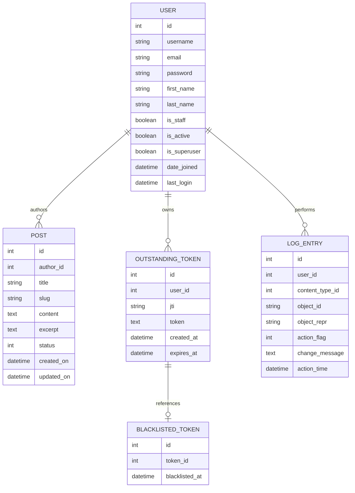

# Password Space Blog - Entity Relationship Diagram

This diagram shows the database schema for the Password Space Blog application, including authentication, blog posts, and JWT token management.

## Tables Overview

| Table | Purpose |
|-------|---------|
| **User** | Authentication & user profiles (Argon2 hashed, 12+ chars min) |
| **Post** | Blog posts with author, slug, draft/published status |
| **OutstandingToken** | Active JWT refresh tokens |
| **BlacklistedToken** | Revoked/logged-out tokens |
| **LogEntry** | Django admin audit trail |

## Key Relationships

- User → Post (1:M, cascade delete)
- User → OutstandingToken (1:M, cascade delete)
- OutstandingToken → BlacklistedToken (1:1)

## Indexes and Constraints

- **Unique Constraints**:
  - `User.username`
  - `Post.title`
  - `Post.slug`
  - `OutstandingToken.jti`
  - `BlacklistedToken.token_id`

- **Ordering**:
  - `Post`: Ordered by `-created_on` (newest first)

## Security Features

- **Password Storage**: Argon2 hashing (memory-hard algorithm)
- **Password Policy**: Minimum 12 characters enforced
- **JWT Tokens**: Stored in HTTP-only cookies (no localStorage exposure)
- **Token Rotation**: New refresh token issued on each refresh
- **Token Blacklist**: Logout immediately invalidates tokens
- **Cookie Security**: Secure, HttpOnly, SameSite=Lax flags
