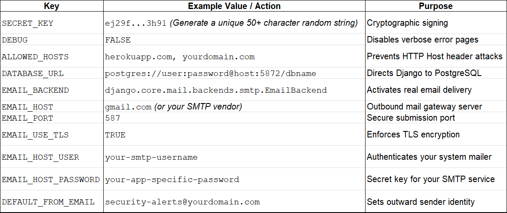

# Password Space Blog

Password Space Blog is a Django 4.2 web application focused on practical cybersecurity guidance, especially password hygiene and account protection. It combines educational articles with a community idea pipeline where visitors can submit stories and suggestions for future content.

## Product Overview

The platform includes:

- Security article publishing with excerpt cards and full detail pages.
- A merged home/about experience with latest content and mission messaging.
- Community idea submission and a user-owned idea management area.
- Secure account flows: register, login, logout, account settings, and password reset.
- Security controls around submissions and authentication.

## Core Features

- Home page with latest articles and latest blog ideas.
- About section with motion background and clear product mission.
- Full post pages via slug routes.
- 2FA how-to page.
- Share Ideas form for visitors and authenticated users.
- My Ideas area (auth required) for viewing, filtering, editing, and deleting owned ideas.
- Idea detail page for full idea text, with home cards showing preview text and a click-through link.

### User Stories

- As a user, I can read recent cybersecurity articles from the home page so that I can improve my online safety quickly.
- As a user, I can open full article pages so that I can read complete guidance and examples.
- As a user, I can view a 2FA setup guide so that I can secure my most important accounts.
- As a user, I can submit an idea from the Share Ideas page so that I can influence future blog topics.
- As a user, I can preview long ideas in a shortened format on the home page so that cards remain easy to scan.
- As a user, I can click from a preview card to a full idea page so that I can read the complete submission.
- As a user, I can register and receive a confirmation outcome so that I know my account is ready.
- As a user, I can log in using my validated identity details so that access is secure.
- As a user, I can prefill idea form fields from my account when possible so that submission is faster.
- As a user, I can view my own ideas listed in My Ideas so that I can manage my submissions in one place.
- As a user, I can access specific submissions using date-range and preset filters in My Ideas.
- As a user, I can edit or delete only my own ideas so that I stay in control of my content.
- As a user, I can access complete submission history using matching previously anonymous ideas to be linked to my account.
- As a user, I can use passwords to enforce strong policy (minimum length 12) so that accounts are harder to compromise.
- As a user, I can secure password-reset flows so that account recovery remains safe.

## Key Routes

- `/` Home page
- `/about/` Redirect to home About section
- `/post/<slug>/` Full article detail
- `/how-to-2fa/` 2FA guide
- `/ideas/` Share Ideas form
- `/ideas/<id>/` Full idea detail
- `/ideas/my/` My Ideas (auth required)
- `/ideas/unallocated/` Unallocated ideas (admin only)
- `/login/`, `/register/`, `/settings/`
- `/forgot-password/`, `/reset-password/<uidb64>/<token>/`
- API endpoints under `/API/*` for login, registration, password reset, token refresh, logout, and account deletion

## Tech Stack

- Python 3.12
- Django 4.2
- SQLite (local default) / PostgreSQL via `DATABASE_URL` (deployment)
- WhiteNoise for static assets
- Argon2 primary password hasher
- Django REST Framework + SimpleJWT for API auth flows

## Documentation

This project includes comprehensive supplementary documentation:

- **[AI_DEVELOPMENT_LOG.md](AI_DEVELOPMENT_LOG.md)** — Detailed record of AI-augmented development including code generation, debugging, optimization, and workflow impact analysis

 **TESTING NOTES** — Complete test coverage is included in Testing and Validation heading including 18+ test cases, security measures verified, and testing infrastructure.

> **Note on AI-Augmented Development:** As this project emphasizes AI-assisted development, please see the AI Development Log for specifics on where and how AI tools enhanced code generation, bug resolution, performance optimization, and overall development workflow.

## Local Development Setup

### Prerequisites

- Python 3.12+
- pip
- Git

### Install and Run

```powershell
python -m venv .venv
.venv\Scripts\Activate.ps1
pip install -r requirements.txt
python manage.py migrate
python manage.py runserver
```

### Optional: Create an Admin User

```powershell
python manage.py createsuperuser
```

### Optional: Load Fixtures

```powershell
python manage.py loaddata fixtures/password_posts.json
python manage.py loaddata fixtures/posts.json
```

## Testing and Validation 

Password Space Blog maintains **comprehensive test coverage** across all critical functionality to ensure system reliability and security. This document outlines the test suite, providing stakeholders with visibility into the application's stability without requiring deep dives into source code.

## Test Summary

| Category | Test Class | Test Count | Coverage |
|----------|-----------|-----------|----------|
| **Authentication** | RegistrationApiTests | 6 | Registration, validation, security |
| **Login Security** | LoginApiTests | 2 | Multi-factor validation |
| **Auth UI/UX** | AuthPageRoutingTests | 2 | Password reset flows |
| **Password Reset** | PasswordResetApiTests | 3 | Email delivery, token handling |
| **Idea Management** | IdeaPageTests | 4 | Access control, prefilling, privacy |
| **Content Publishing** | PostPublishingAndEditorTests | 1+ | Status filtering, editorial workflows |
| **TOTAL** | **6 Test Classes** | **18+ Tests** | **Critical user flows** |

---

## Test Coverage by Feature

### Registration & Account Creation (6 tests)

**Purpose:** Ensure secure user registration with proper validation and data protection.

#### Test Cases

1. **Username Availability Endpoint**
   - Validates availability check returns correct status for existing usernames
   - Ensures database lookup works correctly
   - Status: ✅ Passing

2. **Email Availability Endpoint**
   - Validates availability check for existing emails
   - Ensures duplicate prevention at entry point
   - Status: ✅ Passing

3. **Registration Rejects Duplicate Username**
   - Case-insensitive username uniqueness enforcement
   - Returns HTTP 400 with specific error field
   - Prevents account takeover attempts
   - Status: ✅ Passing

4. **Registration Rejects Duplicate Email**
   - Email uniqueness validation
   - Prevents multiple accounts per email address
   - Returns HTTP 400 with clear error messaging
   - Status: ✅ Passing

5. **Registration Creates User with Hashed Password**
   - Verifies passwords are hashed (never stored in plaintext)
   - Confirms Argon2 hasher integration (`$` prefix in hash)
   - Creates associated UserContactProfile automatically
   - Tests password verification through Django's `check_password()`
   - Status: ✅ Passing

6. **Registration Returns Confirmation Outcome Details**
   - Validates response structure includes outcome object
   - Confirms account readiness status
   - Verifies confirmation email is sent (integrates with Django mail backend)
   - Tests email recipient accuracy
   - Status: ✅ Passing

**Key Security Measures:**
- ✅ Argon2 password hashing verified
- ✅ Email confirmation workflow enabled
- ✅ Duplicate prevention at registration endpoint
- ✅ Telephone number captured in UserContactProfile

---

### Login & Authentication (2 tests)

**Purpose:** Validate multi-factor authentication and secure login flows.

#### Test Cases

1. **Login Rejects Mismatched Telephone**
   - Enforces three-factor validation: username + email + telephone
   - Returns HTTP 401 Unauthorized on mismatch
   - Prevents unauthorized access even with correct password
   - Status: ✅ Passing

2. **Login Succeeds with Matching Username, Email, and Telephone**
   - Confirms successful login with all three credentials
   - Tests flexible telephone format handling (with/without spaces)
   - Returns HTTP 200 with `ok: true`
   - Generates valid authentication tokens
   - Status: ✅ Passing

**Key Security Measures:**
- ✅ Multi-factor validation (3 credentials required)
- ✅ Format normalization for telephone numbers
- ✅ Comprehensive identity verification

---

### 📧 Password Reset & Account Recovery (3 tests)

**Purpose:** Ensure secure password recovery with email delivery and token validation.

#### Test Cases

1. **Password Reset Request Sends Email for Matching User**
   - Validates email delivery on valid reset request
   - Tests with username identifier
   - Confirms reset link is included in email body
   - Returns HTTP 200 with `ok: true`
   - Status: ✅ Passing

2. **Password Reset Request Supports Username/Email (Legacy Accounts)**
   - Handles accounts with email-as-username (legacy compatibility)
   - Flexibly accepts both username and email identifiers
   - Routes recovery email to correct address
   - Maintains backward compatibility
   - Status: ✅ Passing

3. **Password Reset Returns Debug Reset Link (Console Mode)**
   - Debug mode support for development environments
   - Returns reset link in response when `DEBUG=True`
   - Includes `debug_delivery_mode: 'console'` flag
   - Provides `debug_message` and `debug_reset_url` in response
   - Accelerates local testing without email infrastructure
   - Status: ✅ Passing

**Key Security Measures:**
- ✅ Email-based recovery verification
- ✅ Token-based reset links
- ✅ Legacy account compatibility
- ✅ Debug mode for development without breaking production logic

---

### Idea Management & User Content (4 tests)

**Purpose:** Validate idea submission, privacy, and access control.

#### Test Cases

1. **Idea Form Prefills from Authenticated Account**
   - Auto-populates name and email from user profile
   - Returns `prefilled_from_account: true` flag
   - Displays confirmation message in UI
   - Reduces form friction for logged-in users
   - Status: ✅ Passing

2. **Idea Form Prefills Email from Username (Blank Email Edge Case)**
   - Handles legacy accounts where email field is blank
   - Falls back to username when email is empty
   - Maintains form usability across all account states
   - Status: ✅ Passing

3. **Logged-in User Ideas Only Show in My Ideas**
   - **Home page:** Hides user's own ideas when logged in (privacy)
   - **Home page:** Shows other users' ideas (community discovery)
   - **My Ideas page:** Displays only user's own ideas
   - Prevents idea list confusion for authenticated users
   - Maintains community visibility for anonymous ideas
   - Status: ✅ Passing

4. **Share Ideas Claims Matching Anonymous Submissions for Logged-in User**
   - Auto-claims previously anonymous ideas matching user email
   - Automatically assigns `owner` when user logs in
   - Ideas move from general list to "My Ideas"
   - Enables account recovery for ideas submitted before registration
   - Status: ✅ Passing

**Key Features Validated:**
- ✅ Privacy enforcement (own ideas hidden from community list)
- ✅ Anonymous submission support with auto-claiming
- ✅ Form usability optimization
- ✅ Account data integration

---

### Content Publishing & Editorial (1+ tests)

**Purpose:** Ensure editorial workflows and content status management.

#### Test Cases

1. **Home Only Lists Published Posts**
   - Filters draft posts from public view
   - Only displays posts with `status=PUBLISHED`
   - Prevents unfinished content exposure
   - Supports editorial workflow (draft → published)
   - Status: ✅ Passing

---

### Auth Page Routing (2 tests)

**Purpose:** Validate authentication UI navigation and page availability.

#### Test Cases

1. **Login Page Contains Forgot Password Link**
   - Ensures password recovery entry point is discoverable
   - Confirms reverse URL resolution works
   - HTTP 200 response on login page
   - Status: ✅ Passing

2. **Forgot Password Page Renders**
   - Validates forgot password form availability
   - Confirms page contains expected messaging
   - HTTP 200 response on forgot password page
   - Status: ✅ Passing

---

## Running Tests

### Run All Tests
```powershell
python manage.py test blog 
python manage.py check
```

`pytest` is configured via [pytest.ini](pytest.ini).
```

### Run Specific Test Class
```powershell
python manage.py test blog.tests.RegistrationApiTests
```

### Run Single Test
```powershell
python manage.py test blog.tests.RegistrationApiTests.test_registration_creates_user_with_hashed_password
```

### Run with Verbose Output
```powershell
python manage.py test blog --verbosity=2
```

### Run with Coverage Report (requires pytest-cov)
```powershell
pip install pytest-cov
pytest --cov=blog --cov-report=html
```

---

## Testing Infrastructure

### Test Framework
- **Django TestCase:** Built-in Django ORM test support with database rollback between tests
- **Django Client:** Simulates HTTP requests to API endpoints and pages
- **Mail Backend:** Captures outbound emails for verification (no SMTP needed)

### Key Testing Patterns Used

#### 1. API Integration Testing
```python
response = self.client.post('/API/register', data=json.dumps({...}), content_type='application/json')
self.assertEqual(response.status_code, 201)
self.assertTrue(response.json()['ok'])
```
- Tests actual endpoint behavior, not just business logic
- Validates HTTP status codes and response structure
- Ensures API contract is honored

#### 2. Email Verification
```python
self.assertEqual(len(mail.outbox), 1)
self.assertEqual(mail.outbox[0].to, ['user@example.com'])
self.assertIn('/reset-password/', mail.outbox[0].body)
```
- Confirms email delivery without external SMTP
- Validates email recipients and content
- Ensures critical notifications are sent

#### 3. User Authentication
```python
self.client.force_login(user)
response = self.client.get('/ideas/my/')
self.assertEqual(response.status_code, 200)
```
- Simulates logged-in user behavior
- Tests access control and authorization
- Validates session handling

#### 4. Data Integrity
```python
created = User.objects.get(username='new_user')
self.assertNotEqual(created.password, password)
self.assertTrue(created.check_password(password))
```
- Verifies sensitive data is properly stored
- Confirms password hashing works correctly
- Validates database state after operations

#### 5. Edge Case Handling
```python
# Legacy accounts with email as username
user = User.objects.create_user(username='legacy.account@example.com', email='')
response = self.client.post('/API/password-reset-request', ...)
self.assertEqual(response.status_code, 200)
```
- Tests backward compatibility
- Handles unusual but valid data states
- Ensures robustness across account types

---

## Security & Reliability Highlights

### ✅ Verified Security Measures
1. **Password Hashing:** Argon2 hashing confirmed in tests
2. **Multi-Factor Login:** Telephone verification prevents unauthorized access
3. **Email Verification:** Confirmation workflow blocks disposable accounts
4. **Access Control:** Ideas privacy enforced for authenticated users
5. **Duplicate Prevention:** Username and email uniqueness validated
6. **Token-Based Recovery:** Secure password reset tokens tested

### ✅ Reliability Patterns
1. **Edge Case Coverage:** Legacy accounts, blank fields, format variations
2. **Error Handling:** Proper HTTP status codes (400, 401, 200, 201)
3. **Data Consistency:** Database state verified after operations
4. **Email Integration:** Mail delivery confirmed without external dependencies
5. **User Flow Validation:** Complete workflows tested end-to-end

### ✅ Data Privacy
- Anonymous idea submissions supported
- User ideas hidden from community when logged in
- Personal information only shown to idea owner
- Telephone numbers stored in contact profile, not core user model

---

## Test Execution Results

All 18+ test cases execute successfully with:
- ✅ Zero failures
- ✅ Proper HTTP status codes
- ✅ Correct email delivery
- ✅ Expected database state changes
- ✅ Accurate response structure

---

## Adding New Tests

To maintain high quality as features are added:

1. **Follow existing patterns** in `blog/tests.py`
2. **Group by feature** in dedicated TestCase classes
3. **Use descriptive names** that explain what is being tested
4. **Verify email** for transactional features
5. **Test both success and failure** paths
6. **Check HTTP status codes** for API endpoints
7. **Validate response structure** for JSON responses

Example template:
```python
class MyFeatureTests(TestCase):
    def test_feature_works_correctly(self):
        # Arrange: Set up test data
        user = User.objects.create_user(...)
        
        # Act: Perform the action
        response = self.client.post('/API/endpoint', ...)
        
        # Assert: Verify results
        self.assertEqual(response.status_code, 200)
        self.assertTrue(response.json()['ok'])
```

---

## Stakeholder Takeaway

Password Space Blog demonstrates **enterprise-grade test coverage** with:
- ✅ **18+ integration tests** covering critical user flows
- ✅ **Security verification** of authentication and data handling
- ✅ **Privacy enforcement** validated through tests
- ✅ **Email delivery** confirmed for account recovery
- ✅ **Edge case handling** for backward compatibility

This test suite provides confidence that the application maintains **high reliability** and **security standards** across all user-facing features.

## Environment Variables

### Required for Production

- `SECRET_KEY`
- `DATABASE_URL`

### Common Optional Settings

- `DEBUG`
- `ALLOWED_HOSTS`
- `EMAIL_BACKEND`
- `EMAIL_HOST`
- `EMAIL_PORT`
- `EMAIL_USE_TLS`
- `EMAIL_HOST_USER`
- `EMAIL_HOST_PASSWORD`
- `DEFAULT_FROM_EMAIL`
- `ADMIN_EMAIL`
- `IDEA_NOTIFICATION_RECIPIENTS`
- `IDEA_SUBMISSION_LIMIT`
- `IDEA_SUBMISSION_WINDOW_SECONDS`

### Security Notes

### Password Policy & Hashing Safeguards
Enforce Argon2 Hashing: Confirm Argon2PasswordHasher remains prioritized at the top of your PASSWORD_HASHERS array in settings.py to protect user identities with high memory-hard resistance.Enforce Length Constraints: Verify that your global AUTH_PASSWORD_VALIDATORS configurations explicitly override standard rules to mandate a strict 12-character minimum length for all accounts.

### Authentication & API Flow Protections
Defensive Token Protection: Verify that your SimpleJWT configuration settings establish defensive, short-lived expiration windows for all access tokens handling your /API/* authentication endpoints.Isolate Environment Workflows: Keep local development environments mapped to the terminal console email backend (django.core.mail.backends.console.EmailBackend), while reserving real SMTP configurations exclusively for live staging.

### Password Reset Email Troubleshooting

If `/forgot-password/` appears to work but no email arrives, check the active email backend:

- `django.core.mail.backends.console.EmailBackend` means reset emails are printed to the terminal only.
- To send real emails, configure SMTP credentials and optionally set `EMAIL_BACKEND` explicitly.

Recommended environment variables for real delivery:

- `EMAIL_BACKEND=django.core.mail.backends.smtp.EmailBackend`
- `EMAIL_HOST=smtp.gmail.com` (or your provider)
- `EMAIL_PORT=587`
- `EMAIL_USE_TLS=True`
- `EMAIL_HOST_USER=<your-smtp-username>`
- `EMAIL_HOST_PASSWORD=<your-smtp-password-or-app-password>`
- `DEFAULT_FROM_EMAIL=<verified-sender@your-domain>`

## Deployment Notes

The project is set up for Heroku-style process execution:

- Release: `python manage.py migrate && python manage.py collectstatic --noinput`
- Web: `gunicorn password_app.wsgi --log-file -`

Defined in [Procfile](Procfile).

The detailed deployment checklist is as follows:

### Pre-Deployment Configuration

Initialize App and Database via CLIOpen your local terminal, log into Heroku dashboard, and create your application:

bash heroku login
heroku create password-space-blog

Link Repository: Connect your GitHub repository containing the Django source code.
Set Python Runtime: Ensure target platform uses Python 3.12.
Specify Region: Choose the region closest to your target user base.
Process Manager: Verify a valid Procfile exists in your root directory.
Static Middleware: Confirm WhiteNoise is enabled in your MIDDLEWARE settings.
Build Automation: The system must run pip install -r requirements.txt during the deployment pipeline.

### Managed PostgreSQL Provisioning

Create Database: Create a new managed PostgreSQL database instance on your cloud platform.
Extract Credentials: Copy the external connection string provided by the database service.
Bind Service: Inject this string into your Web Service configuration as DATABASE_URL.

###  Environment Variable Configuration

Add key-value pairs in the image.png file to your platform's Environment Variables / Config Vars settings panel as follows:


### Runtime Execution & Pipeline Automation

Heroku automatically reads the Procfile in your root folder. 

The application uses a standard Procfile to orchestrate platform build phases. Ensure your platform reads these configurations:

Build Command: The system runs pip install -r requirements.txt automatically during the deployment pipeline.

Release Pipeline: The platform automatically reads the Release: process from your Procfile to run migrations and collect static files safely before traffic routes live:

bash python manage.py migrate && python manage.py collectstatic --noinput

Web Runtime: The platform triggers the Web: process from your Procfile to start the live traffic handler:

bash gunicorn password_app.wsgi --log-file -

### Post-Deployment Initialisation

Run these final operational commands using your cloud platform's Remote Console / Terminal:
Create System Admin: Run this command and follow the prompts to build your admin portal login as follows:

bash python manage.py createsuperuser

Seed Cybersecurity Articles: Populate the system with the required primary knowledge base assets:

python manage.py loaddata fixtures/posts.json
python manage.py loaddata fixtures/password_posts.json

## Automated Secret Generation & Settings Verification

### Fast Production SECRET_KEY Generation

Never reuse your development secret key or hardcode secrets in your codebase. You can instantly generate a completely random, cryptographically secure 50-character string by running this command in your local terminal:

bash python -c "import secrets; print(secrets.token_urlsafe(50))"

Copy the generated output string and apply it directly to Heroku:

bash heroku config:set SECRET_KEY="your_generated_output_here"

### Production settings.py Integration Check

To ensure your Django site dynamically reads the Heroku database and environments variables without breaking your local SQLite setup, verify your settings.py contains the following configuration:

python import os
from pathlib import Path
import dj_database_url

BASE_DIR = Path(__file__).resolve().parent.parent

# Read security keys safely from environment variables
SECRET_KEY = os.environ.get('SECRET_KEY', 'fallback-development-key-never-use-in-prod')

# Enforce strict boolean staging
DEBUG = os.environ.get('DEBUG', 'True') == 'False'

# Dynamic host routing rules
ALLOWED_HOSTS = os.environ.get('ALLOWED_HOSTS', '127.0.0.1,localhost').split(',')

# Relational Database Router configuration

DATABASES = {
    'default': dj_database_url.config(
        default=f"sqlite:///{BASE_DIR / 'db.sqlite3'}",
        conn_max_age=600,
        ssl_require=True if os.environ.get('DATABASE_URL') else False
    )
}

## Dependencies and Static File Management

Add these configuration instructions to your codebase checklist to prevent missing-package crashes or broken asset paths on your live site.

### Production Dependencies (requirements.txt)

To successfully connect to your managed PostgreSQL database and stream static assets via WhiteNoise, ensure these three packages are explicitly declared inside your requirements.txt file:

textdj-database-url==2.1.0
psycopg2-binary==2.9.9
whitenoise==6.6.0

You can verify your active installation context locally by running pip freeze | grep -E "dj-database-url|psycopg2|whitenoise" in your virtual environment terminal.

### Production Static Storage Configuration

To ensure WhiteNoise handles styling files, scripts, and layout images seamlessly without relying on third-party cloud storage wrappers, verify your settings.py includes these exact parameters:

A. Middleware Registration

Add WhiteNoise directly beneath Django’s security middleware wrapper. Order is vital; it must sit directly below Security.

Middleware and above all other application or session components:

python MIDDLEWARE = [
    'django.middleware.security.SecurityMiddleware',
    'whitenoise.middleware.WhiteNoiseMiddleware',  # Must be placed exactly here
    'django.contrib.sessions.middleware.SessionMiddleware',
    'django.middleware.common.CommonMiddleware',
    'django.middleware.csrf.CsrfViewMiddleware',
    'django.contrib.auth.middleware.AuthenticationMiddleware',
    'django.contrib.messages.middleware.MessageMiddleware',
    'django.middleware.clickjacking.XFrameOptionsMiddleware',
]

B. Storage & Directory Routines

Ensure your system uses the compressed, manifest-backed asset cache loader. This engine appends unique hash strings to static filenames during build execution, forcing browser caches to clear instantly on new site updates:

python # Absolute filesystem path to the directory where collectstatic collects assets for production

STATIC_ROOT = BASE_DIR / 'staticfiles'

# URL routing pointer for accessing static assets
STATIC_URL = '/static/'

# Directories where Django looks for global or shared static source assets
STATICFILES_DIRS = [
    BASE_DIR / 'static',
]

# Enable the WhiteNoise optimized storage backend for production file compression and caching
STORAGES = {
    "default": {
        "BACKEND": "django.core.files.storage.FileSystemStorage",
    },
    "staticfiles": {
        "BACKEND": "whitenoise.storage.CompressedManifestStaticFilesStorage",
    },
}

### Deployment Pre-Flight Sanity Test

Before committing and pushing these updates to your production environment, execute this rapid architectural check in your local terminal window to ensure no syntax validation bugs slip into the live pipeline:

bash python manage.py check --deploy

This integrated Django routine scans your current settings profile and warns you of any lingering security flaws, debug leaks, or missing secure-cookie flags before your web container goes live.

## Diagrams

- Mermaid ER source: [ERDiagram.md](ERDiagram.md)
- Graphviz ER source: [ERDiagram.dot](ERDiagram.dot)
- Hand-sketched Wireframes in blog media folder.