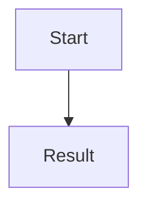

# erDiagram
    USER ||--o{ VAULT_ITEM : "owns"
    USER ||--o{ BLOG_POST : "writes"
    CATEGORY ||--o{ BLOG_POST : "classifies"
    CATEGORY ||--o{ VAULT_ITEM : "organizes"

    USER {
        int user_id PK
        string username
        string email
        string master_password_hash
    }

    VAULT_ITEM {
        int item_id PK
        int user_id FK
        int category_id FK
        string service_name
        string encrypted_password
    }

    BLOG_POST {
        int post_id PK
        int author_id FK
        int category_id FK
        string title
        text content
        datetime created_at
    }

    CATEGORY {
        int category_id PK
        string name
        string type "Vault or Blog"
    }

