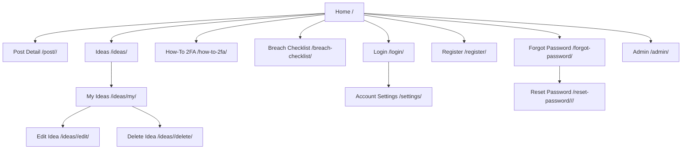

# Password Space Blog - Structural Layout

## 1. Global Page Shell

All pages inherit from `templates/base.html` and follow this structure:

1. Sticky Header (`<nav class="navbar">`)
2. Flash Messages Area (success/error banners)
3. Main Content (``)
4. Footer (About, Contact, Location)

## 2. Site Map (Route Structure)

## 3. Front-End Page Layouts

## Home (`templates/index.html`)

1. Hero Section
2. Focus/Info Section
3. Latest Articles Grid
4. Submit-Idea Callout
5. Latest Community Ideas Preview

## Ideas (`templates/ideas.html`)

1. Intro + guidance text
2. Idea submission form
3. Validation/error messages
4. Community ideas list (all visitors)
5. Owner-only controls on own ideas (Edit/Delete)

## My Ideas (`templates/my_ideas.html`)

1. Auth-only page
2. Table of current user's ideas
3. Actions: Edit/Delete

## Edit Idea (`templates/idea_edit.html`)

1. Auth + ownership check
2. Editable title and idea body
3. Save/Cancel actions

## 4. Backend Structure

## URL Entry Points

- Root router: `password_app/urls.py`
- Feature router: `blog/urls.py`

## Models (`blog/models.py`)

- `Post`
- `Comment`
- `Idea` (includes `owner` for account-based permissions)

## Views (`blog/views.py`)

- Class-based content pages: `PostList`, `PostDetail`, `HowToPageView`, `ChecklistPageView`
- Idea flow:
  - `ideas_page` (create + list)
  - `my_ideas_page` (view own)
  - `edit_idea_page` (edit own)
  - `delete_idea` (delete own)

## Admin (`blog/admin.py`)

- Full visibility of all submitted ideas for moderators/admins
- Filters/search for review workflows

## 5. Authentication and Permissions Rules

1. Any visitor can submit an idea on `/ideas/`
2. Any visitor can view community ideas
3. Only authenticated owners can edit/delete their own ideas
4. Admin can see all ideas in `/admin/`

## 6. API Layer (Account and Security Flows)

- `/API/register`
- `/API/login`
- `/API/logout`
- `/API/token/refresh`
- `/API/delete-account`
- `/API/password-reset-request`
- `/API/password-reset-confirm`

These APIs support auth/account workflows used by the front end.
